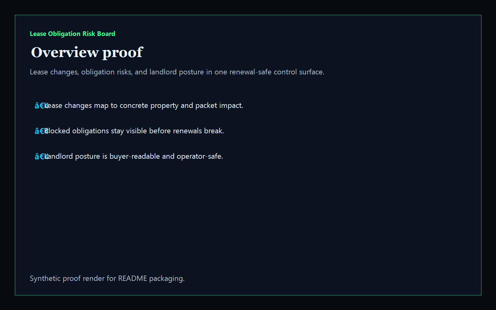
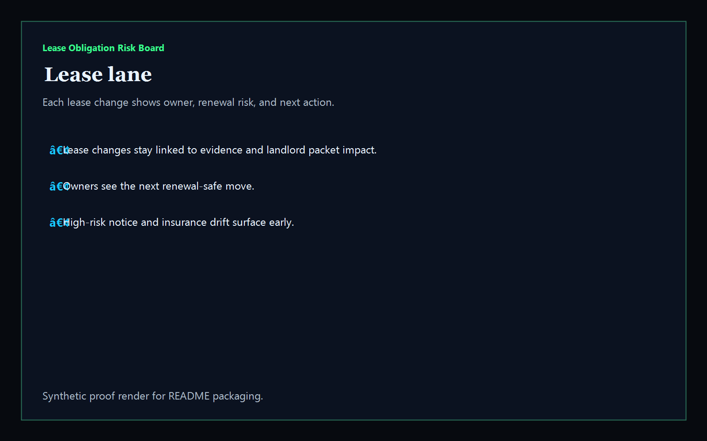
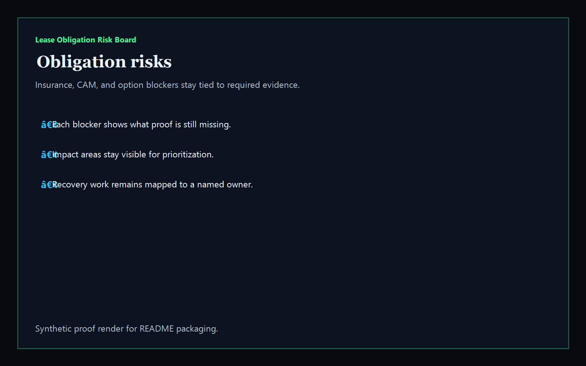
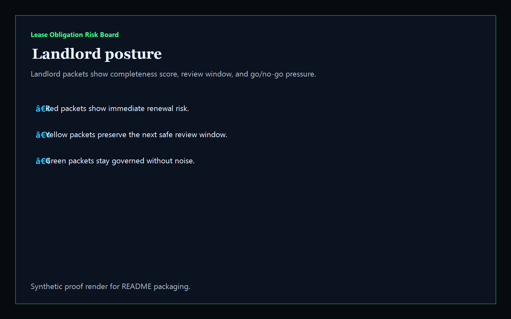

# Lease Obligation Risk Board

[](https://github.com/mizcausevic-dev/lease-obligation-risk-board/actions/workflows/ci.yml)
[](./LICENSE)
[](./.github/dependabot.yml)
[](https://github.com/mizcausevic-dev/lease-obligation-risk-board/actions/workflows/pages.yml)

TypeScript operator surface for lease obligations, renewal blockers, landlord packet readiness, and property-safe review posture.

## Why this exists

- Real-estate teams lose trust when lease changes, insurance packets, CAM schedules, and option notices live in separate systems.
- Renewals need a clear view of which obligations, rider changes, counsel reviews, and landlord packets still block the next signature-safe move.
- PropTech buyers care whether a lease can circulate safely without fragmenting evidence, tenant acknowledgments, or option timing.
- Operator tooling should turn renewal chaos into governed obligations, named ownership, and measurable packet readiness.

## Why this matters (KG Embedded tie-back)

This repo demonstrates the lease-governance primitive for PropTech / Real Estate buyers: lease changes, obligation blockers, and landlord posture tied into one operator surface. A B2B SaaS buyer would care because leasing, property, and tenant evidence often need to surface inside customer-facing products without exposing unsafe write paths or fragmented packet history. Kinetic Gain Embedded extends this into security-first in-product analytics for property, leasing, and revenue workflows, see [kineticgain.com/embedded](https://kineticgain.com/embedded).

## Routes

- `/`
- `/lease-lane`
- `/obligation-risks`
- `/landlord-posture`
- `/verification`
- `/docs`

## API

- `/api/dashboard/summary`
- `/api/lease-lane`
- `/api/obligation-risks`
- `/api/landlord-posture`
- `/api/verification`
- `/api/sample`

## Screenshots






## Local Development

```powershell
cd lease-obligation-risk-board
npm install
npm run dev
```

Open:
- [http://127.0.0.1:5544/](http://127.0.0.1:5544/)
- [http://127.0.0.1:5544/lease-lane](http://127.0.0.1:5544/lease-lane)
- [http://127.0.0.1:5544/obligation-risks](http://127.0.0.1:5544/obligation-risks)
- [http://127.0.0.1:5544/landlord-posture](http://127.0.0.1:5544/landlord-posture)
- [http://127.0.0.1:5544/verification](http://127.0.0.1:5544/verification)

## Validation

- `npm run build`
- `npm run test`
- `npm run coverage`
- `npm run demo`
- `npm run smoke`
- `npm run prerender`
- `npm run render:assets`

## Production status

| Aspect | Status |
|--------|--------|
| CI | Node 20 + 22 matrix — lint · typecheck · coverage · build · demo · smoke · `npm audit` ([workflow](./.github/workflows/ci.yml)) |
| Test coverage | `src/services/` coverage gate maintained via `vitest` |
| License | [AGPL-3.0-or-later](./LICENSE) |
| Dependencies | Dependabot weekly (npm + GitHub Actions); `npm audit --audit-level=high` in CI |
| Data handling | Synthetic, non-sensitive lease packets only. No live tenant, address, financial, or legal records. |
| Deploy | Static prerender → **https://lease.kineticgain.com/** (GitHub Pages, [pages workflow](./.github/workflows/pages.yml)) |

## Docs

- [Architecture](./docs/architecture.md)
- [Origin](./docs/ORIGIN.md)
- [Kinetic Gain Embedded tie-back](./docs/KINETIC_GAIN_EMBEDDED.md)
- [Changelog](./CHANGELOG.md)

## Part of the Kinetic Gain Suite

Operator surface in the [Kinetic Gain Suite](https://suite.kineticgain.com/) — a portfolio of buyer-readable control planes spanning security posture, compliance evidence, data-platform governance, FinOps, and operator workflows. Apex: [kineticgain.com](https://kineticgain.com/).

## Related surfaces

- [**`lease-obligation-risk-board`**](https://github.com/mizcausevic-dev/lease-obligation-risk-board) — lease renewals, obligation proof, and landlord packet posture
- [**`tenant-maintenance-escalation-console`**](https://github.com/mizcausevic-dev/tenant-maintenance-escalation-console) — future maintenance exception routing lane
- [**`portfolio-vacancy-yield-studio`**](https://github.com/mizcausevic-dev/portfolio-vacancy-yield-studio) — future property yield analytics lane
